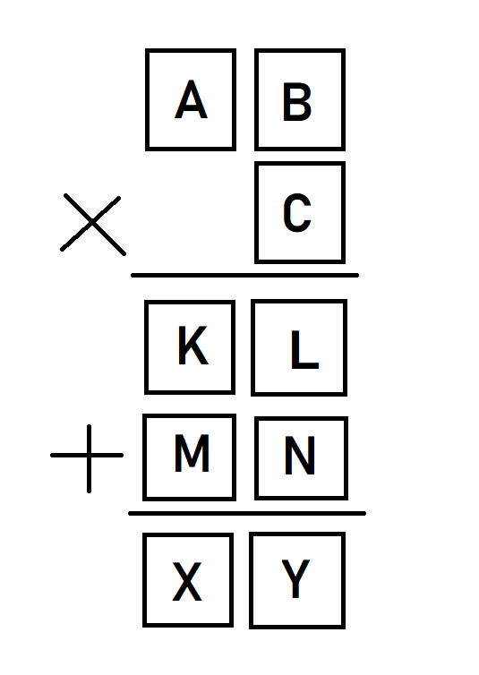

# FITB Solver
This is a Fill in the blanks(FITB) riddle solver written in python.

---

## Intro
FITB riddle is at its core a math problem so i have used math to solve in though the method may be crude and brute forced is works.

The riddle to be solved is.

Here we are supposed to fill the in boxes with numbers from 1 to 9 without repeating.
