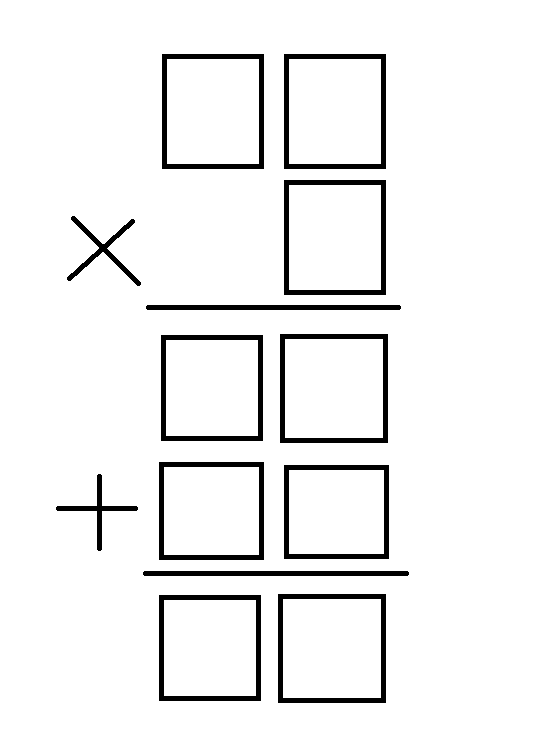

# FITB Solver
This is a Fill in the blanks(FITB) riddle solver written in python.

---

## Intro
FITB riddle is at its core a math problem so i have used math to solve in though the method may be crude and brute forced is works.

The riddle to be solved is.



Here we are supposed to fill the in boxes with numbers from 1 to 9 without repeating.

## Solution
There are two solutions that I have found one is to look at each step individually and try solve to it a human would.
The other is two create a math equation and try to solve the equation this method should be more straight forward and easier for the computer.

### Method:1
For this method we have to create multiple arrays like so:
``` python
numbers = [1,2,3,4,5,6,7,8,9]
available_numbers = []
used_numbers = []
```
Here the first array is the numbers we can fill in the boxes with and the other two arrays are what their names suggest.
Available array is the array of numbers not used to fill the boxes and used array is the one already used.
From this we can see that every time the algorithm is executed the array numbers with have to be copied to available_numbers like so:
```python
for i in range(1,10):
  available_numbers[i] = numbers[i]
```
This code will have to be executed everytime because every time at the start of the algorithm the boxes will be empty i.e. no numbers have been filled in.
This not only makes the code messy it also slows the process of finding the solution hence the method is not that appealing.

### Method:2
This method is the more straight forward one. Here we create a simple math equation that matches the riddle and have the program solve the equation. To make it easier to understand the equation let us first lable the boxes to be filled because in this method we are looking at the problem as a whole all at once unlike the previous method where we went step by step. Let us lable the boxes like so:


Now, if we write the problem as is in equation form it will look something like:

$$(10*a+b)*c = (10*k+l) + (10*m+n) = (10*x+y)$$

The problem with this is that we can't put this statement in the code as there are two assignments in the same line. Also we need to check if any of the variables are the same thus solving this equation straight up is not a solution.
So, we will divide the problem into two parts the multiplication part and the addition part.

#### Multiplication:
$$(10*a+b)*c = [some variable]$$
Then we will seperate the [some variable] into two variables namely [k] and [l].
That will be done by this code:
```python
l = [some variable] % 10
[some variable] /= 10
k = [some variable] % 10
```
For this code block to work we will have to make sure the number we get after the multiplication is a two digit number, the code for that is:
```python
# no solution found
```

#### Addition:
$$(10*k+l) + (10*m+n) - (10*x+y) = 0$$
